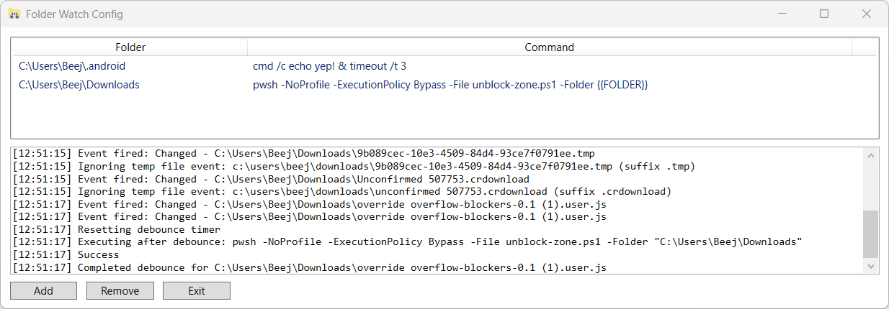

# FolderWatch

A Windows PowerShell utility that monitors folders for file changes and automatically executes custom commands when changes are detected.



## Features

- **Real-time monitoring**: Watch multiple folders simultaneously using .NET FileSystemWatcher
- **WPF interface**: Clean, modern UI with system tray integration
- **Streaming log**: Built-in log viewer shows all watcher activity and command execution in real-time
- **Debouncing**: Smart 500ms debounce prevents duplicate executions during rapid file changes
- **Temp file filtering**: Ignores temporary browser downloads (.crdownload, .part, .partial, .tmp)
- **Custom commands**: Run any command or script when changes are detected
- **Token replacement**: Use `{{FOLDER}}` in commands to reference the watched folder path

## Requirements

- Windows PowerShell 5.1+ or PowerShell 7+
- .NET Desktop Runtime (for WPF)

## Usage

Launch the watcher:
```powershell
pwsh -ExecutionPolicy Bypass -File FolderWatch.ps1
```

### Adding a Watcher

1. Click **Add** button
2. Select folder to monitor
3. Enter command to execute (e.g., `pwsh -File unblock-zone.ps1 -Folder {{FOLDER}}`)
4. Watcher starts immediately

### Editing Watchers

Double-click folder path or command text to edit.

### System Tray

The app minimizes to the system tray. Click the tray icon to show/hide the window. Close the window to hide it; use the Exit button to quit completely.

## Configuration

Watchers persist to `FolderWatchConfig.ini` in the same directory as the script. Format:
```
C:\Path\To\Folder|command.exe --arg "{{FOLDER}}"
```

## Example Commands

Auto-unblock downloaded files:
```powershell
pwsh -File unblock-zone.ps1 -Folder {{FOLDER}}
```

Run a simple notification:
```cmd
cmd /c echo Changed! & timeout /t 3
```

Archive folder contents:
```cmd
"C:\Program Files\7-Zip\7z.exe" a "{{FOLDER}}\backup.7z" "{{FOLDER}}\*"
```
